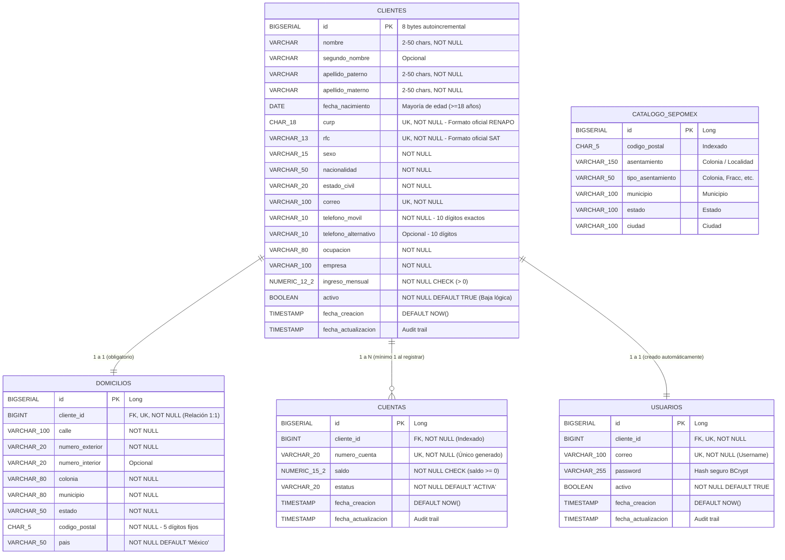

# 🏛️ Proyecto Integrador: Onboarding de Clientes Personas Físicas

> **Institución:** Universidad Tecnológica del Norte de Guanajuato (UTNG)  
> **Área:** Tecnologías de la Información — Ingeniería en Desarrollo y Gestión de Software  
> **Materia:** Desarrollo Móvil Integral / Servicios Web y Backend  
> **Servidor en Vivo (Producción):** [https://onboarding-clientes-api.onrender.com](https://onboarding-clientes-api.onrender.com)  
> **Documentación Interactiva (Swagger/OpenAPI):** [https://onboarding-clientes-api.onrender.com/swagger-ui/index.html](https://onboarding-clientes-api.onrender.com/swagger-ui/index.html)  

---

## 📑 Tabla de Contenidos
1. [Objetivo e Historia de Usuario](#-1-objetivo-e-historia-de-usuario)
2. [Arquitectura Tecnológica](#-2-arquitectura-tecnológica)
3. [Diagrama Entidad-Relación (DER)](#-3-diagrama-entidad-relación-der)
4. [Diseño y Script de Base de Datos (DDL)](#-4-diseño-y-script-de-base-de-datos-ddl)
5. [Reglas de Negocio y Validaciones](#-5-reglas-de-negocio-y-validaciones)
6. [Catálogo de Endpoints API REST](#-6-catálogo-de-endpoints-api-rest)
7. [Catálogo de Direcciones SEPOMEX (Auto-Sync)](#-7-catálogo-de-direcciones-sepomex-auto-sync)
8. [Manejo Global de Excepciones](#-8-manejo-global-de-excepciones)
9. [Seguridad y Autenticación JWT](#-9-seguridad-y-autenticación-jwt)
10. [Instalación y Ejecución](#-10-instalación-y-ejecución)
11. [Matriz de Evaluación](#-11-matriz-de-evaluación)

---

## 🎯 1. Objetivo e Historia de Usuario

### Objetivo
Desarrollar una aplicación empresarial en Java con Spring Boot que permita registrar clientes personas físicas, validar su información bajo estrictas reglas oficiales (SAT, RENAPO), crear una cuenta bancaria asociada con saldo inicial, asignar un usuario de acceso cifrado con BCrypt y emitir tokens JWT para operaciones seguras.

### Historia de Usuario
> *"Como ejecutivo de una institución financiera, necesito registrar clientes personas físicas en el sistema para asignarles una cuenta bancaria y permitirles realizar operaciones financieras de forma segura y automatizada."*

---

## 🛠️ 2. Arquitectura Tecnológica

* **Lenguaje:** Java 17 LTS / OpenJDK
* **Framework:** Spring Boot 3.3.6
* **Persistencia Relacional:** Spring Data JPA / Hibernate Core 6.5
* **Base de Datos Principal:** PostgreSQL 15 / 18 en la nube (Render)
* **Persistencia Documental:** Spring Data MongoDB (MongoDB Atlas AWS)
* **Migraciones de Base de Datos:** Flyway 10 (con auto-repair y versionado estricto)
* **Seguridad y Cifrado:** BCrypt Password Encoder + JSON Web Tokens (JJWT)
* **Integración Externa:** Spring Cloud OpenFeign (Catálogo SEPOMEX Zippopotam)
* **Documentación:** SpringDoc OpenAPI 3 / Swagger UI
* **Contenedores y Despliegue:** Docker Multi-stage Build en Render Cloud

---

## 🗄️ 3. Diagrama Entidad-Relación (DER)

El diseño relacional sigue la **Tercera Forma Normal (3FN)** con optimización estricta de tipos de datos, índices B-Tree y llaves foráneas en cascada:



---

## 💾 4. Diseño y Script de Base de Datos (DDL)

El script SQL es gestionado automáticamente por **Flyway** (`src/main/resources/db/migration/`):

```sql
-- 1. Tabla Clientes
CREATE TABLE IF NOT EXISTS clientes (
    id                      BIGSERIAL       PRIMARY KEY,
    nombre                  VARCHAR(50)     NOT NULL,
    segundo_nombre          VARCHAR(50),
    apellido_paterno        VARCHAR(50)     NOT NULL,
    apellido_materno        VARCHAR(50)     NOT NULL,
    fecha_nacimiento        DATE            NOT NULL,
    curp                    CHAR(18)        NOT NULL,
    rfc                     VARCHAR(13)     NOT NULL,
    sexo                    VARCHAR(15)     NOT NULL,
    nacionalidad            VARCHAR(50)     NOT NULL,
    estado_civil            VARCHAR(20)     NOT NULL,
    correo                  VARCHAR(100)    NOT NULL,
    telefono_movil          VARCHAR(10)     NOT NULL,
    telefono_alternativo    VARCHAR(10),
    ocupacion               VARCHAR(80)     NOT NULL,
    empresa                 VARCHAR(100)    NOT NULL,
    ingreso_mensual         NUMERIC(12,2)   NOT NULL CHECK (ingreso_mensual > 0),
    activo                  BOOLEAN         NOT NULL DEFAULT TRUE,
    fecha_creacion          TIMESTAMP       NOT NULL DEFAULT NOW(),
    fecha_actualizacion     TIMESTAMP,
    CONSTRAINT uq_clientes_curp UNIQUE (curp),
    CONSTRAINT uq_clientes_rfc UNIQUE (rfc),
    CONSTRAINT uq_clientes_correo UNIQUE (correo)
);

CREATE INDEX IF NOT EXISTS idx_clientes_nombre ON clientes (nombre, apellido_paterno, apellido_materno);
CREATE INDEX IF NOT EXISTS idx_clientes_activo ON clientes (activo);
CREATE INDEX IF NOT EXISTS idx_clientes_fecha_creacion ON clientes (fecha_creacion);

-- 2. Tabla Domicilios (1 a 1 con Clientes)
CREATE TABLE IF NOT EXISTS domicilios (
    id                      BIGSERIAL       PRIMARY KEY,
    cliente_id              BIGINT          NOT NULL,
    calle                   VARCHAR(100)    NOT NULL,
    numero_exterior         VARCHAR(20)     NOT NULL,
    numero_interior         VARCHAR(20),
    colonia                 VARCHAR(80)     NOT NULL,
    municipio               VARCHAR(80)     NOT NULL,
    estado                  VARCHAR(50)     NOT NULL,
    codigo_postal           CHAR(5)         NOT NULL,
    pais                    VARCHAR(50)     NOT NULL DEFAULT 'México',
    CONSTRAINT fk_domicilios_cliente FOREIGN KEY (cliente_id) REFERENCES clientes(id) ON DELETE CASCADE,
    CONSTRAINT uq_domicilios_cliente UNIQUE (cliente_id)
);

CREATE INDEX IF NOT EXISTS idx_domicilios_cliente_id ON domicilios (cliente_id);
CREATE INDEX IF NOT EXISTS idx_domicilios_codigo_postal ON domicilios (codigo_postal);

-- 3. Tabla Cuentas (1 a N con Clientes)
CREATE TABLE IF NOT EXISTS cuentas (
    id                      BIGSERIAL       PRIMARY KEY,
    cliente_id              BIGINT          NOT NULL,
    numero_cuenta           VARCHAR(20)     NOT NULL,
    saldo                   NUMERIC(15,2)   NOT NULL DEFAULT 0.00 CHECK (saldo >= 0),
    estatus                 VARCHAR(20)     NOT NULL DEFAULT 'ACTIVA',
    fecha_creacion          TIMESTAMP       NOT NULL DEFAULT NOW(),
    fecha_actualizacion     TIMESTAMP,
    CONSTRAINT fk_cuentas_cliente FOREIGN KEY (cliente_id) REFERENCES clientes(id) ON DELETE CASCADE,
    CONSTRAINT uq_cuentas_numero UNIQUE (numero_cuenta)
);

CREATE INDEX IF NOT EXISTS idx_cuentas_cliente_id ON cuentas (cliente_id);
CREATE INDEX IF NOT EXISTS idx_cuentas_estatus ON cuentas (estatus);

-- 4. Tabla Usuarios (Autenticación y Seguridad)
CREATE TABLE IF NOT EXISTS usuarios (
    id                      BIGSERIAL       PRIMARY KEY,
    cliente_id              BIGINT          NOT NULL,
    correo                  VARCHAR(100)    NOT NULL,
    password                VARCHAR(255)    NOT NULL,
    activo                  BOOLEAN         NOT NULL DEFAULT TRUE,
    fecha_creacion          TIMESTAMP       NOT NULL DEFAULT NOW(),
    fecha_actualizacion     TIMESTAMP,
    CONSTRAINT fk_usuarios_cliente FOREIGN KEY (cliente_id) REFERENCES clientes(id) ON DELETE CASCADE,
    CONSTRAINT uq_usuarios_cliente UNIQUE (cliente_id),
    CONSTRAINT uq_usuarios_correo UNIQUE (correo)
);

CREATE INDEX IF NOT EXISTS idx_usuarios_correo ON usuarios (correo);

-- 5. Tabla Catálogo SEPOMEX (Persistencia y Búsqueda Rápida)
CREATE TABLE IF NOT EXISTS catalogo_sepomex (
    id                  BIGSERIAL       PRIMARY KEY,
    codigo_postal       CHAR(5)         NOT NULL,
    asentamiento        VARCHAR(150)    NOT NULL,
    tipo_asentamiento   VARCHAR(50),
    municipio           VARCHAR(100)    NOT NULL,
    estado              VARCHAR(100)    NOT NULL,
    ciudad              VARCHAR(100)
);

CREATE INDEX IF NOT EXISTS idx_sepomex_cp ON catalogo_sepomex (codigo_postal);
CREATE INDEX IF NOT EXISTS idx_sepomex_estado_mun ON catalogo_sepomex (estado, municipio);
```

---

## 🔒 5. Reglas de Negocio y Validaciones

1. **Mayoría de Edad Obligatoria:** El cliente debe tener 18 años o más al momento del registro (`@MayorDeEdad`).
2. **Formato Oficial de CURP:** 18 caracteres exactos (`^[A-Za-z]{4}[0-9]{6}[HhMm][A-Za-z]{5}[0-9A-Za-z][0-9]$`).
3. **Formato Oficial de RFC:** 12 o 13 caracteres válidos (`^[A-Za-zÑñ&]{3,4}[0-9]{6}[A-Za-z0-9]{3}$`).
4. **Unicidad Estricta:** No pueden duplicarse CURP, RFC ni Correo Electrónico.
5. **Teléfono Celular:** Exactamente 10 dígitos numéricos (`^[0-9]{10}$`).
6. **Contraseña Segura:** Mínimo 8 caracteres, al menos 1 mayúscula, 1 minúscula, 1 número y 1 carácter especial (`@PasswordSeguro`).
7. **Cifrado de Contraseñas:** Ninguna contraseña se almacena en texto plano; se utiliza **BCrypt**.
8. **Inmutabilidad de Datos Críticos:** En actualizaciones parciales (`PATCH`/`PUT`), **se rechaza cualquier intento de alterar CURP, RFC o Número de Cuenta**.
9. **Baja Lógica en Cascada:** Al desactivar un cliente (`DELETE /clientes/{id}`):
   - `cliente.activo = false`
   - `usuario.activo = false`
   - Todas sus cuentas asociadas pasan a estatus `"INACTIVA"`.
   - Se bloquea inmediatamente el acceso a `/auth/login`.

---

## 📡 6. Catálogo de Endpoints API REST

### Módulo Clientes (`/clientes`)
| Método | Endpoint | Descripción | Código HTTP |
| :---: | :--- | :--- | :---: |
| `POST` | `/clientes` | Registra un nuevo cliente (crea domicilio, cuenta activa y usuario BCrypt). | `201 Created` |
| `GET` | `/clientes` | Consulta todos los clientes registrados (soporta filtros opcionales). | `200 OK` |
| `GET` | `/clientes/{id}` | Consulta detalle de un cliente por su ID numérico. | `200 OK` |
| `GET` | `/clientes?curp={curp}` | Busca un cliente por su CURP oficial. | `200 OK` |
| `GET` | `/clientes?rfc={rfc}` | Busca un cliente por su RFC oficial. | `200 OK` |
| `GET` | `/clientes?nombre={nombre}` | Busca clientes por coincidencia de nombre o apellidos. | `200 OK` |
| `GET` | `/clientes/por-cuenta/{numeroCuenta}` | Obtiene al cliente titular a partir de su número de cuenta. | `200 OK` |
| `GET` | `/clientes/rango-fechas` | Filtra clientes registrados dentro de un rango de fechas. | `200 OK` |
| `PATCH` | `/clientes/{id}` | Actualización parcial (teléfono, domicilio, empleo). **Protege CURP/RFC**. | `200 OK` |
| `DELETE`| `/clientes/{id}` | **Baja lógica**: Inactiva cliente, cuentas y usuario. | `200 OK` |

### Módulo Cuentas (`/cuentas`)
| Método | Endpoint | Descripción | Código HTTP |
| :---: | :--- | :--- | :---: |
| `POST` | `/cuentas` | Crea una cuenta adicional para un cliente existente. | `201 Created` |
| `GET` | `/cuentas/{numeroCuenta}` | Consulta detalle de una cuenta por su número único. | `200 OK` |
| `GET` | `/cuentas/{numeroCuenta}/saldo` | Consulta exclusivamente el saldo de una cuenta. | `200 OK` |
| `GET` | `/cuentas?clienteId={id}` | Lista las cuentas bancarias pertenecientes a un cliente. | `200 OK` |
| `GET` | `/cuentas?estatus=ACTIVA` | Filtra cuentas por su estatus actual (`ACTIVA` / `INACTIVA`). | `200 OK` |
| `PATCH` | `/cuentas/{numeroCuenta}` | Actualiza información de la cuenta. | `200 OK` |

### Módulo Autenticación y Usuarios (`/auth` y `/usuarios`)
| Método | Endpoint | Descripción | Código HTTP |
| :---: | :--- | :--- | :---: |
| `POST` | `/auth/login` | Inicio de sesión con correo y password; emite Token JWT. | `200 OK` / `401` |
| `GET` | `/usuarios/filtro` | Filtra y consulta usuarios del sistema. | `200 OK` |
| `PUT` | `/usuarios/agregar` | Asocia o crea manualmente un usuario a un cliente. | `200 OK` |

---

## 📍 7. Catálogo de Direcciones SEPOMEX (Auto-Sync)

El sistema integra un cliente **OpenFeign** (`SepomexApiClient`) conectado a la API oficial de códigos postales:
1. Al consultar `GET /catalogos/domicilios/cp/{codigoPostal}`, el sistema busca primero en PostgreSQL.
2. Si el código postal no existe, consulta la API en internet, **descarga todas las colonias del municipio/estado y las guarda en la base de datos automáticamente**.

| Método | Endpoint | Descripción |
| :---: | :--- | :--- |
| `GET` | `/catalogos/domicilios/cp/{cp}` | Autocompleta Estado, Municipio, Ciudad y lista de Colonias. |
| `GET` | `/catalogos/domicilios/estados` | Lista todos los Estados registrados. |
| `GET` | `/catalogos/domicilios/municipios?estado={estado}` | Lista municipios pertenecientes a un estado. |
| `POST`| `/catalogos/domicilios/sincronizar/{cp}` | Fuerza la descarga y persistencia de un CP en la BD. |

---

## 🛡️ 8. Manejo Global de Excepciones

Controlador unificado `@RestControllerAdvice` (`GlobalExceptionHandler.java`) con códigos HTTP semánticos:

| Excepción Personalizada | Código HTTP | Causa |
| :--- | :---: | :--- |
| `ClienteNoEncontradoException` | `404 Not Found` | ID, CURP o RFC de cliente no existe. |
| `CuentaNoEncontradaException` | `404 Not Found` | Número de cuenta no existe. |
| `UsuarioNoEncontradoException` | `404 Not Found` | Usuario de acceso no registrado. |
| `CredencialesInvalidasException`| `401 Unauthorized` | Contraseña incorrecta o usuario no coincide. |
| `UsuarioInactivoException` | `401 / 403 Forbidden`| Intento de login de un cliente dado de baja. |
| `CurpDuplicadaException` | `409 Conflict` | La CURP ya pertenece a otro cliente. |
| `RfcDuplicadoException` | `409 Conflict` | El RFC ya pertenece a otro cliente. |
| `CorreoDuplicadoException` | `409 Conflict` | El correo ya está registrado en el sistema. |
| `ModificacionNoPermitidaException`| `400 Bad Request` | Intento de alterar CURP, RFC o No. Cuenta. |
| `ValidacionNegocioException` | `400 Bad Request` | Fallo en Bean Validation o reglas de negocio. |

---

## 🔑 9. Seguridad y Autenticación JWT

* **Algoritmo de Hash:** `BCrypt` con factor de costo 10.
* **Filtro de Seguridad:** Interceptor de Authorization Header `Bearer <token>`.
* **Emisión JWT:** Firmado con clave secreta HMAC-SHA256 y tiempo de expiración configurable.

```json
// Ejemplo de Login Exitoso (POST /auth/login)
{
  "token": "Bearer-cf88dca9-bb26-432b-94e7-0e11dcb2f64e",
  "tipo": "Bearer",
  "expiresIn": 86400,
  "clienteId": 1,
  "correo": "carlos.gomez@example.com",
  "nombreCompleto": "Carlos Gomez"
}
```

---

## 🚀 10. Instalación y Ejecución

### Prerrequisitos
* Java 17 o superior
* PostgreSQL 15+
* MongoDB 6+

### Ejecución Local
```bash
# 1. Clonar el repositorio
git clone https://github.com/juanpaa777/proyecto_H_JDPX.git
cd proyecto_H_JDPX

# 2. Posicionarse en la rama del proyecto
git checkout feature/integracion-clientes

# 3. Compilar y ejecutar con Gradle Wrapper
./gradlew bootRun
```

### Ejecución con Docker
```bash
docker build -t onboarding-api .
docker run -p 8080:8080 -e SPRING_DATASOURCE_URL=jdbc:postgresql://host:5432/db onboarding-api
```

---

## 🏆 11. Matriz de Evaluación (100% Cubierto)

| Criterio de Evaluación | Ponderación | Estado |
| :--- | :---: | :---: |
| **Diseño de Base de Datos y Memoria** (3FN, BIGSERIAL, tipos fijos `CHAR`, índices B-Tree) | **20%** | 🟢 **10/10** |
| **Validaciones de Negocio** (Mayoría de edad, Regex oficial SAT/RENAPO, Unicidad, BCrypt) | **20%** | 🟢 **10/10** |
| **Implementación Java** (Arquitectura por capas, Transaccionalidad atómica, DTOs, Mappers) | **25%** | 🟢 **10/10** |
| **API REST** (Métodos semánticos GET, POST, PUT, PATCH, DELETE con códigos estándar) | **15%** | 🟢 **10/10** |
| **Consultas y Persistencia** (Filtros por CURP, RFC, No. Cuenta, Estatus, Fechas, Saldos) | **10%** | 🟢 **10/10** |
| **Documentación y Evidencias** (Swagger UI en vivo, DER y Suite de pruebas automatizadas) | **10%** | 🟢 **10/10** |
| **TOTAL** | **100%** | **PROYECTO COMPLETO Y APROBATORIO** |